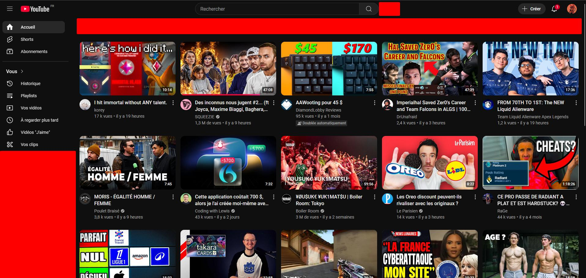
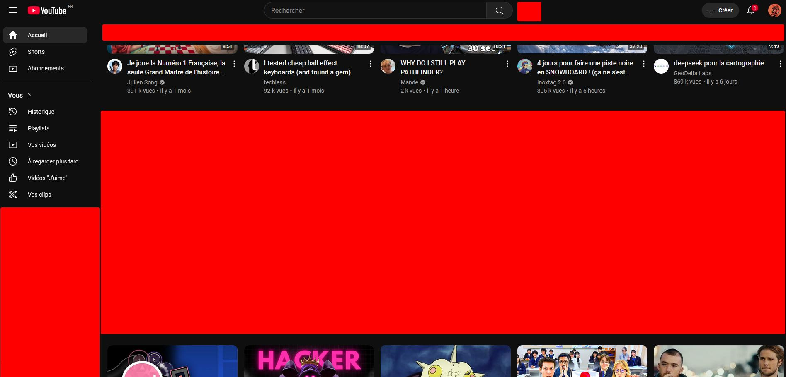
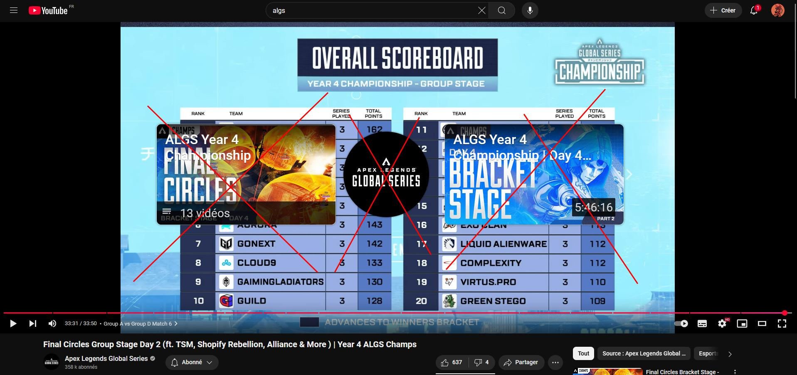
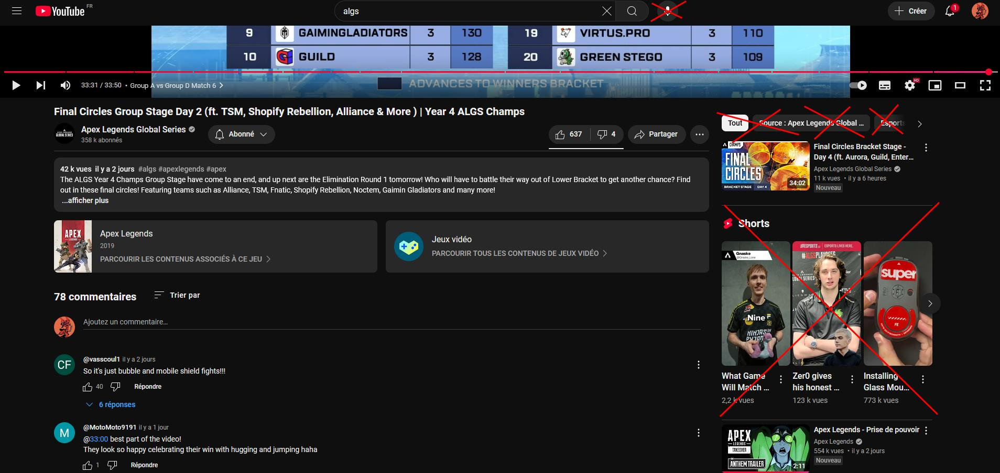

# Yu
🔓 Youtube Unlocker

## Features
- **Shorts:** Remove all integration of YouTube Shorts
- **Paid content:** Remove paid content from video selection
- **Feed bar:** Remove feed bar
- **Video preview:** Remove video preview
- **End video promotion:** Remove content promotion at the end
- **Sign YouTube:** Remove YouTube red color and replace it
- **Tabs content:** Remove tab left content to keep it minimal

## Showcase
|                           |                           |
|:-------------------------:|:-------------------------:|
|  |  |
|  |  |
|                           |                           |

## Installation
1. Download the latest version from [Firefox Add-ons](https://addons.mozilla.org/en-US/firefox/addon/youtube-unlocker-yu/).
2. Load the extension in Firefox via `about:addons`.

## Contributing
Feel free to open issues or submit pull requests to improve the extension!

## License
This project is licensed under the [MIT License](https://github.com/Neotoxic-off/Yu/blob/main/LICENSE).
